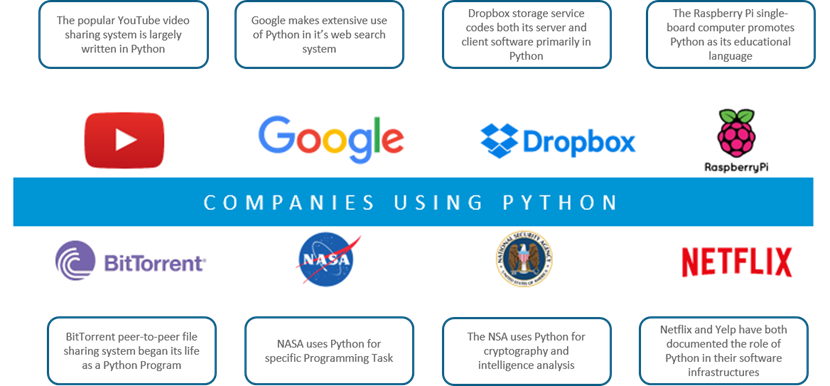
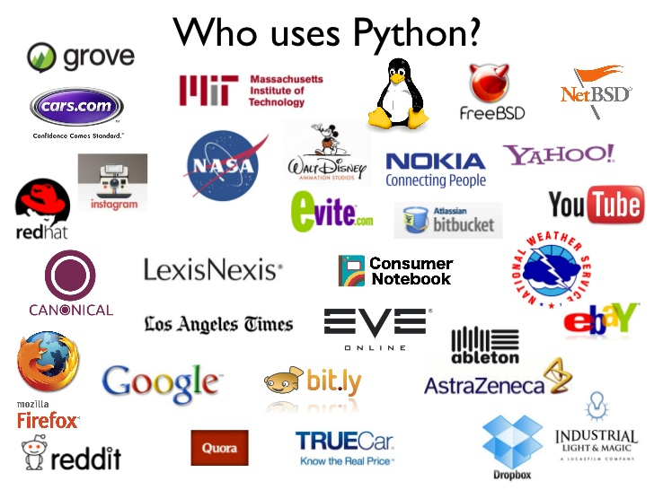
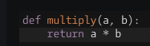

# Урок 1. Знайомство з Python

## Знайомство з викладачем.


## Знайомство з мовою.


Як використовувати мову?

А ще як?

Хто використовує мову?


Все у програмуванні структуровано, підкоряється логіці, **алгоритмізовано**.

Написання програми вимагає насамперед знання мови, а вміння будувати логічні ланцюжки, пов'язувати події між собою, тобто будувати алгоритми.

Для побудови алгоритмів рекомендується використати блок-схеми. Спочатку студентам настійно рекомендується будувати блок-схеми навіть для найпростіших завдань, далі - тільки для тих, які здаються їм складними.

## Блок-схеми

**Блок-схемою** називають графічне представлення алгоритму. У блок-схемі крок чи послідовність кроків алгоритму представляються у вигляді блоку, а між блоками встановлюють зв'язки.

Початок та кінець алгоритму зображуються округленими прямокутниками, звичайні дії – прямокутниками, умови – ромбами, введення та виведення даних – паралелограмами.
Для більш детального ознайомлення з блок-схемами читайте [вікіпедію](https://ru.wikipedia.org/wiki/%D0%91%D0%BB%D0%BE%D0%BA-%D1%81%D1%85%D0%B5%D0%BC%D0%B0) на цю тему, й дивитесь **правило 2**.

Як приклад побудуємо блок-схему алгоритму підбору викладача на курси A-Level Ukraine :)


## Змінні в Python: визначення, типи даних.

**Змінною** називається найменована область у пам'яті, де зберігаються дані. Змінна має тип та ім'я.
Для того, щоб створити змінну та записати в неї значення, використовується оператор присвоєння (=).
Кожна змінна в python на сьогодні може мати тільки один тип.

**Типом змінної** називається той вид даних, який на цей час може зберігати змінна.
Всі види даних у мовах програмування можна віднести до двох груп: скалярні (прості) типи даних та структуровані (складені) типи даних.


На цьому уроці ми працюємо тільки зі скалярними типами даних integer (цілі числа) та string (рядок), який є послідовністю символів. Докладніше структуровані типи даних будуть розглянуті на наступних уроках.

Далі представлені змінні різних скалярних (простих) типів:

```python
my_integer = 4     #цілі числа
my_float = 4.12    #дробові числа
my_char = 'a'      #символи
my_bool = True     #правда чи брехня, булеві значення

```

## Типізація

**Статична типізація** означає, що тип змінної визначається спочатку і залишається незмінним остаточно програми. Якщо змінна спочатку оголошена контейнером для цілих чисел, у ній можуть бути лише цілі числа.

**Динамічна типізація** означає, що ту саму змінну можна спочатку ініціалізувати рядком, потім числом, потім булевим значенням, і так далі. Таким чином, тип змінної визначається її значенням на поточний момент часу.

**Сильна (строга) типізація** не дозволяє мові програмування ігнорувати різницю між типами даних операндів.

**Слабка (нестрога) типізація** дозволяє мові вільно інтерпретувати тип змінних їх взаємодії, мова сам змінює тип змінної залежно від її використання. Наприклад, якщо додати рядок, у якому записано число, мова автоматично додасть число, що у рядку.

[Лікнеп по типізації](https://habr.com/ru/post/161205/)


Далі представлені змінні різних основних типів у мові:

```python
my_integer = 4     #цілі числа
my_float = 4.12    #дробові числа
my_str = 'aaaa'      #рядки
my_bool = True     #True, False, правда чи брехня, булеві значення
my_list = [1, 2, 3, 'x'] # Список з різнорідними елементами
my_tuple = (1, [2]) # кортеж - незмінна послідовність
my_dict = {'2':2, '3':3} # словник - невпорядкована послідовність
my_set = set((1, 2, 3, 2, 1)) # множина
>>> my_set
{1, 2, 3}
```

Тут ми побачили числа, цілі та дробові, рядок, булеву змінну, список, кортеж, множину та словник.


## Найпростіші математичні операції з цілими числами
Над цілими та дробовими числами доступні математичні операції множення (+), поділу (/), віднімання (-), додавання (+), зведення у степінь (**) та отримання залишку від поділу (%):

```python
int1 = 4
int2 = 8
result = int1 + int2      # result = 12
result = int2 - int1      # result = 4
result = int1 * int2      # result = 32
result = (int2+1) // int1  # result = 2
result = int2 ** int1     # result = 4096
result = (int2+1) % int1  # result = 1
```

## Виведення даних

Для виведення даних використовується функція `print`:

```python
int1 = 4
str1 = "8"
print(int1)   #виводить 4
print('text') #виводить text
print("text") #виводить text
print(str1)   #виводить 8
```

## Мінливі та незмінні типи даних.

У Python є типи даних, що змінюються (mutable) і незмінні (immutable).

Раніше розглядався тип даних int, який є незмінним. Також незмінними є типи даних tuple (кортеж) і string (рядок).

Що означає незмінні? Отже, спочатку створений рядок ми змінити не можемо. Це легко покажуть подальші приклади з рядками та кортежами. Якщо ж здається, що об'єкт однієї з перелічених даних змінився - отже тепер ім'я об'єкта просто вказує нову область у пам'яті з новим об'єктом.


## Перша програма

Як перша програма ми напишемо невеликий скрипт. Скрипт отримуватиме на вхід суми грошей, підсумовуватиме їх і припинить свою роботу, коли сума перевищить тисячу (наприклад, доларів США). Кожну введену суму скрипт розподілятиме по шести "конвертах":

* Конверт на "необхідні витрати та потреби" отримує 55% всіх коштів.
* Конверти на "фінансову свободу", "освіту", "резерв і більше покупки" та "розваги" отримують по 10% коштів.
* Конверт "на подарунки" отримує 5% коштів, що залишилися.
 
Для зручності роботи з програмою її буде розбито на невеликі шматки. Усередині програми є коментарі англійською мовою, а поза кодом шматки програми прокоментовані російською.

```python
# -*- coding: utf-8 -*-
# initializing empty envelops

necessityEnvelop = 0  # NEC, необхідні витрати
freedomEnvelop = 0    # FFA, фінансова свобода
educationEnvelop = 0  # EDU, освіта
longTermEnvelop = 0   # LTSS, резерв та на великі покупки
playEnvelop = 0       # PLAY, розваги
giveEnvelop = 0       # GIVE, подарунки

# initializing percent rate
necRate = 0.55
ffaRate = 0.1
eduRate = 0.1
ltssRate = 0.1
playRate = 0.1
giveRate = 0.05
# initializing expected income, expected necessity and other amounts
expectedIncome = 1000
```
*Ініціалізація змінних конвертів та коефіцієнтів*

```python
# invitation, greetings etc.
print ("""Hello.\n
We gonna fill your envelops by the money you input here!\n
Please input your amounts of money income and see the results.\n
Press Ctrl+c to exit script.
\n\n Enter the amount please:""")
```
*Виведення запрошення у консолі*

```python
# initializing handler for standard input
sum = 0

while (sum < expectedIncome):
    line = int(input())
    sum += line

    necessityEnvelop += line * necRate
    freedomEnvelop += line * ffaRate
    educationEnvelop += line * eduRate
    longTermEnvelop += line * ltssRate
    playEnvelop += line * playRate
    giveEnvelop += line * giveRate

    print("\n Enter the amount please:")

```
*Цикл обробки сум, що надходять від користувача*

Рядок

```python
line = int(input())
```
Означає "рахувати в змінну line один рядок з консолі".

```python
# final output
print("At the end we have:\n\
    Necessity Envelop has:                       " + str(int(necessityEnvelop)) + "\n\
    Financial Freedom Envelop has:               " + str(int(freedomEnvelop)) + "\n\
    Education Envelop                            " + str(int(educationEnvelop)) + "\n\
    Long Term Saving for Spending Envelop has:   " + str(int(longTermEnvelop)) + "\n\
    Play Envelop has:                            " + str(int(playEnvelop)) + "\n\
    Give Envelop has:                            " + str(int(giveEnvelop)) + "\n\
    _______________________________________________________________\n\
\
    Thanks for using our software :)")
```
*Результівне виведення даних*

## Посилання

[Правила](rules.md)

## Домашнє завдання №1

#### Перший рівень ("а й так норм"):

- Сформулювати своє розуміння, що таке тип даних.
- Сформулювати своє розуміння типізацій - динамічної, статичної, сильної та слабкої.

#### Другий рівень ("яжпрограмміст"):

Зареєструватися на сайтах:

[GitHub](https://github.com/) - для збереження версій коду та майбутніх домашок

[ReplIt](https://replit.com/) - для того, щоб практикувати Python online, якщо раптом не працює встановлений.

[CodeWars](https://www.codewars.com/) - для вирішення величезної кількості практичних завдань (там буде маленьке практичне завдання для реєстрації, потрібно на останньому рядку дописати слово `return` перед тим, що там вже написано)




#### Третій рівень ("кулхацкер"):

Встановити програми:

- Sublime Text ([link](https://www.sublimetext.com/))
- Python останньої стабільної версії ([link](https://www.python.org/downloads/))
- git bash ([link](https://git-scm.com/downloads))


