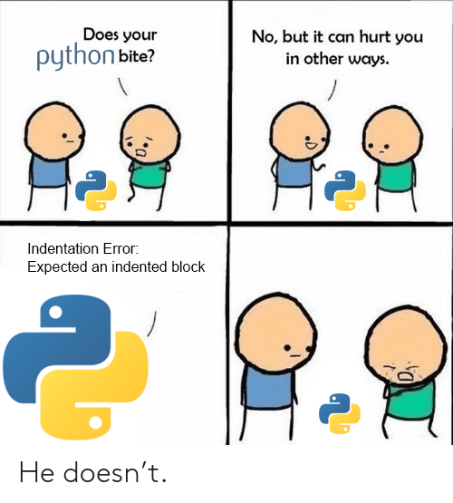

# Урок 1. Знайомство з Python

## Знайомство з викладачем


## Знайомство з мовою


Як використовувати мову?


А ще як?


Хто використовує мову?


Все у програмуванні структуровано, підкоряється логіці, **алгоритмізовано**.

Написання програми вимагає насамперед знання мови, а вміння будувати логічні ланцюжки, пов'язувати події між собою, тобто будувати алгоритми.

Для побудови алгоритмів рекомендується використати блок-схеми. Спочатку студентам наполегливо рекомендується будувати блок-схеми навіть для найпростіших завдань, надалі - тільки для тих, які здаються їм складними.

## Блок-схеми

**Блок-схемою** називають графічне представлення алгоритму. У блок-схемі крок чи послідовність кроків алгоритму представляються у вигляді блоку, а між блоками встановлюються зв'язки.

Початок та кінець алгоритму зображуються округленими прямокутниками, звичайні дії – прямокутниками, умови – ромбами, введення та виведення даних – паралелограмами.
Для більш детального ознайомлення з блок-схемами читайте [вікіпедію](https://ru.wikipedia.org/wiki/%D0%91%D0%BB%D0%BE%D0%BA-%D1%81%D1%85%D0%B5%D0%BC%D0%B0) на цю тему, й дивитесь **правило 2**.

Як приклад, побудуємо блок-схему алгоритму підбору викладача на курси A-Level Ukraine :)


## Змінні в Python: визначення, типи даних.

**Змінною** називається іменована область у пам'яті, де зберігаються дані. Змінна має тип та ім'я.
Для того, щоб створити змінну та записати в неї значення, використовується оператор присвоєння (=).
Кожна змінна в python одночасно може мати тільки один тип.

**Типом змінної** називається той вид даних, що на цей час може зберігати змінна.
Всі види даних у мовах програмування можна віднести до двох груп: скалярні (прості) типи даних та структуровані (складені) типи даних.


На цьому уроці ми працюємо тільки зі скалярними типами даних integer (цілі числа) та string (рядок), який є послідовністю символів. Докладніше структуровані типи даних будуть розглянуті на наступних уроках.

Далі представлені змінні різних скалярних (простих) типів:

```python
my_integer = 4     #цілі числа
my_float = 4.12    #дробові числа
my_char = 'a'      #символи
my_bool = True     #правда чи брехня, булеві значення

```


## Типізація

**Статична типізація** означає, що тип змінної визначається від самого початку і залишається незмінним до кінця програми. Якщо змінна спочатку оголошена контейнером для цілих чисел, у ній можуть бути лише цілі числа.

**Динамічна типізація** означає, що ту саму змінну можна спочатку ініціалізувати рядком, потім числом, потім булевим значенням, і так далі. Таким чином, тип змінної визначається її значенням на поточний момент часу.

**Сильна (строга) типізація** не дозволяє мові програмування ігнорувати різницю між типами даних операндів.

**Слабка (нестрога) типізація** дозволяє мові вільно інтерпретувати тип змінних для їх взаємодії, мова сама змінює тип змінної залежно від її використання. Наприклад, якщо додати рядок, у якому записано число, мова автоматично додасть число, що у рядку.

[Лікнеп по типізації](https://habr.com/ru/post/161205/)


Далі представлені змінні різних основних типів у мові:

```python
my_integer = 4     #int, цілі числа
my_float = 4.12    #float, дробові числа
my_str = 'aaaa'      #str, рядки
my_bool = True     #bool, True, False, правда чи брехня, булеві значення
my_list = [1, 2, 3, 'x'] #list,  Список з різнорідними елементами
my_tuple = (1, [2]) # tuple, кортеж - незмінна послідовність
my_dict = {'2':2, '3':3} # dict, словник - невпорядкована послідовність
my_set = set((1, 2, 3, 2, 1)) # set, множина
>>> my_set
{1, 2, 3}
```

Тут ми побачили числа, цілі та дробові, рядок, булеву змінну, список, кортеж, множину та словник.


## Зміна типів, casting

Для того, щоб отримати з даних одного типу дані іншого типу, треба використовувати так званий кастінг, перетворення з одного типу в інший. Звісно, це працює тільки тоді, коли така можливісь фізично існує. 

Для такої трансформації python пропонує використовувати відповідні до назв типів даних функції. Якщо треба перетворити до рядку - str, якщо до цілого числа - int і так далі.

Давайте дивитися на прикладах:

```python
>>> s = '123'
>>> s
'123'
>>> i = int(s)
>>> i
123
>>> f = float(s)
>>> f
123.0
>>> b = bool(s)
>>> b
True
```

 Спочатку трансформуємо рядок до цілого числа, дробового числа та буліана, тобто всі прості.
 
 Далі спробуємо складені типи:
 
 ```python
 >>> l = list(s)
>>> l
['1', '2', '3']
>>> s1 = set(s)
>>> s1
{'3', '1', '2'}
>>> t = tuple(s)
>>> t
('1', '2', '3')
 ```
 
 Як легко можна побачити, рядок можна перетворити майже у всі стандартні типи даних. Окрім словнику?
 
 ```python
 >>> d = dict(s)
Traceback (most recent call last):
  File "<stdin>", line 1, in <module>
ValueError: dictionary update sequence element #0 has length 1; 2 is required
 ```
 Тут помилка. Тут вже потрібно мати вкладені елементи, ми подживимось на це трохи пізніше.

## Мінливі та незмінні типи даних.

У Python є типи даних, що змінюються (mutable) і незмінні (immutable).

Сьогодні ми знайомимося з цілим числом та рядком. Обидва типи даних є незмінними. Це означає, що в памʼяті, де розташовано перший зміст змінної, в цілому не буде збережено наступний. Це не завжди помітно, але це треба мати на увазі.


## Найпростіші математичні операції з цілими числами

Ми пропустимо створення цілих чисел, бо це дуже просто, й перейдемо до того, що можна з ними робити :)

Над цілими та дробовими числами доступні математичні операції множення, поділу, віднімання, додавання, зведення у степінь та отримання залишку від поділу:

```python
>>> int1 = 9
>>> int2 = 4
>>> result = int1+int2
>>> result = int1-int2
>>> result = int1*int2
>>> result = int1/int2
>>> result
2.25
>>> result = int1//int2
>>> result
2
>>> result = int1**int2
>>> result
6561
>>> result = int1%int2
>>> result
1
```

## Рядки

### Створення рядків, лапки

У python між одинарними й подвійними лапками практично немає різниці, а ще є два види потрійних. Всі типи лапок можуть бути вставлені одні в одні. Потрійні так же дозволяють перехід на новий рядок всередині рядка:

```python
S1 = 'Welcome to strings'
S2 = "Another string"
S3 = """And '''another'''
long
string"""
S4 = 'This "string" is a bit """crazy"""'
```

### Прості операції

Прості арифметичні операції складання і множення доступні і з рядками. У прикладі нижче - складання двох рядків (конкатенація), множення рядка на число та взяття конкретного елемента рядка за його індексом. Індекси у всіх послідовностях у програмуванні вважаються від нуля. По негативному індексу - відраховуємо від кінця рядка назад.

```python
S = 'abc'
print (len(S)) # 3
S = S + '12' # В S = 'abc12'
print (S[2])   # 'c'
print ('ab'*2) #  'abab'
```


### Рядки - незмінний тип

Тепер перевіримо, наскільки незмінними є рядки і як з цим боротися:


```python
S = 'asdfghj'
S[5] = 's'
Traceback (most recent call last):
  File "<stdin>", line 1, in <module>
TypeError: 'str' object does not support item assignment
S = S[:5] + 's' + S[6:]
```

### Корисні функції роботи з рядками

```python
>>> S
'Welcome to California!'
>>> len(S) # get length of the string
22
>>> S.find('C') # get index of the first substring found
11
>>> S.replace('C', '7') # Replaces all the substrings to the new one mentioned
'Welcome to 7alifornia!'
>>> S.split() # Cuts the string using the separator provided, creates a list. By default space is used as a separator
['Welcome', 'to', 'California!']
>>> S.upper()
'WELCOME TO CALIFORNIA!'
>>> S += '\n\n'
>>> S
'Welcome to California!\n\n'
>>> S.rstrip() # removes space-like symbols at the end of string
'Welcome to California!'
```

Додаткову інформацію про рядки та функції роботи з ними можна знайти за посиланням: 
[Детальніше про рядки](http://rtfm.co.ua/python_s_nulya/python-s-nulya-chast-7-stroki/)

### Форматування рядків

Існує багато засобів створення рядків. Можна створювати новий рядок, використовуючи як існуючи рядки у змінних, так і нові літерали. Найпростіший варіант - конкатенація:

```python
>>> S = 'Welcome to'
>>> C = 'Ukraine!'
>>> print(S + ' ' + C)
>>> 
Welcome to Ukraine!
```

#### Форматування з оператором %

Є найбільш застарілий варіант форматування рядків за допомогою оператора %. Цей підхід зʼявився ще у часи створення мови програмування Фортран [(Printf)](https://ru.wikipedia.org/wiki/Printf) 

Працює це так:

```python
>>> S = 'Welcome to'
>>> C = 'Ukraine!'
>>> print('%s %s' % (S, C))
>>>
Welcome to Ukraine!
```

- **`%s`** всередині рядка означає, що тут буде підставлено рядок
- **`%`** після рядку - оператор підставляння
- кортеж з двома змінними - рядками, яких буде підставлено замість **`%s`**

Окрім **`%s`** для позначення рядка, також використовуються **`%d`** для цілих чисел та **`%f`** для чисел с крапкою, що плаває:

```python
>>> C = 'Ukraine'
>>> S = 'welcomed'
>>> print('%d people are %s in %s!' % (3, S, C))
3 people are welcomed in Ukraine!
```

[Декілька варіантів використання оператора форматування %](https://pythonworld.ru/osnovy/formatirovanie-strok-operator.html)

#### Форматування за допомогою метода .format()

Метод `.format()` є свіжішим та покращує синтаксис форматування в цілому, але при обробці великих рядків все ж таки буде виникати проблема з читанням.

Використовуючи метод рядка **.format()** можна форматувати рядок різними способами:
- підставляючи змінні підряд, вказуючи позицію
- підставляючи змінні підряд без вказання позиції
- підставляючи змінні по назві
- в змішаному стилі

Наприклад, з вказанням позиції:

```python
>>> S = "Information! {0} people are {1} {2} {3}!"
>>> S.format(3, 'welcomed', 'in', 'Ukraine')
'Information! 3 people are welcomed in Ukraine!'
```
Без вказання позиції:

```python
>>> S = "Information! {} people are {} {} {}!"
>>> S.format(3, 'welcomed', 'in', 'Ukraine')
'Information! 3 people are welcomed in Ukraine!'
```

З назвою:

```python
S = "Information! Russian people are {reaction} {pretext} {country}!"
print(S.format(country = "USA", pretext = "over", reaction = 'hated'))
# Information! Russian people are hated over USA!
```

[Більше інформації за посиланням](https://pyprog.pro/python/py/str/str_format_method.html)

#### Форматування за допомогою префіксу `f`

Найсвіжіший варіант форматування рядків - за допомогою префіксу `f`. Знайомимось на прикладі:

```python
>>> name = 'Jake'
>>> f'He said his name is {name}'
# 'He said his name is Jake'
>>> f'He said his name is {name!r}'
# "He said his name is 'Jake'"
```

Цей варіант швидший або принаймні такий же швидкий, як інші варіанти форматування, але читається набагато легше.

Зверніть увагу на `!r`, це цукор для виклику метода `repr()`, що показує репрезентативний варіант обʼєкта. Є ще цікаві варіанти методів `str()` та `ascii()`, відповідно `!s` та `!a`. Перший повертає обʼєкт у вигляді рядка, другий - у презентативному вигляді, але на відміну від `repr()`, він екранує символи, які не є стандартними літерами.

А ось ще цікавий приклад мультірядкового варіанта форматування:

```python
name = "Eric"
profession = "comedian"
affiliation = "Monty Python"
message = (
    f"Hi {name}. "
    f"You are a {profession}. "
    f"You were in {affiliation}."
)
print(message)
#'Hi Eric. You are a comedian. You were in Monty Python.'
```

[Велика стаття по префіксах та форматуванню](https://pyprog.pro/python/py/str/str_lit.html)


## Виведення даних

Для виведення даних використовується функція `print`:

```python
int1 = 4
str1 = "8"
print(int1)   #виводить 4
print('text') #виводить text
print("text") #виводить text
print(str1)   #виводить 8
```

## Перша програма

Як першу програму    ми напишемо невеликий скрипт. Скрипт отримуватиме на вхід суми грошей, складатиме їх, і припинить свою роботу, коли сума перевищить тисячу (наприклад, доларів США). Кожну введену суму скрипт розподілятиме по шести "конвертах":

* Конверт на "необхідні витрати та потреби" отримує 55% всіх коштів.
* Конверти на "фінансову свободу", "освіту", "резерв і великі покупки" та "розваги" отримують по 10% коштів.
* Конверт "на подарунки" отримує 5% коштів, що лишилися.
 
Для зручності роботи з програмою її буде розбито на невеликі частини. Всередині програми є коментарі англійською мовою, а поза кодом частини програми прокоментовані українською.

```python
# -*- coding: utf-8 -*-
# initializing empty envelops

necessityEnvelop = 0  # NEC, необхідні витрати
freedomEnvelop = 0    # FFA, фінансова свобода
educationEnvelop = 0  # EDU, освіта
longTermEnvelop = 0   # LTSS, резерв та на великі покупки
playEnvelop = 0       # PLAY, розваги
giveEnvelop = 0       # GIVE, подарунки

# initializing percent rate
necRate = 0.55
ffaRate = 0.1
eduRate = 0.1
ltssRate = 0.1
playRate = 0.1
giveRate = 0.05
# initializing expected income, expected necessity and other amounts
expectedIncome = 1000
```
*Ініціалізація змінних конвертів та коефіцієнтів*

```python
# invitation, greetings etc.
print ("""Hello.\n
We gonna fill your envelops by the money you input here!\n
Please input your amounts of money income and see the results.\n
Press Ctrl+c to exit script.
\n\n Enter the amount please:""")
```
*Виведення запрошення у консолі*

```python
# initializing handler for standard input
sum = 0

while (sum < expectedIncome):
    line = int(input())
    sum += line

    necessityEnvelop += line * necRate
    freedomEnvelop += line * ffaRate
    educationEnvelop += line * eduRate
    longTermEnvelop += line * ltssRate
    playEnvelop += line * playRate
    giveEnvelop += line * giveRate

    print("\n Enter the amount please:")

```
*Цикл обробки сум, що надходять від користувача*




Рядок

```python
line = int(input())
```
Означає "зчитати в змінну line один рядок з консолі".

```python
# final output
print("At the end we have:\n\
    Necessity Envelop has:                       " + str(int(necessityEnvelop)) + "\n\
    Financial Freedom Envelop has:               " + str(int(freedomEnvelop)) + "\n\
    Education Envelop                            " + str(int(educationEnvelop)) + "\n\
    Long Term Saving for Spending Envelop has:   " + str(int(longTermEnvelop)) + "\n\
    Play Envelop has:                            " + str(int(playEnvelop)) + "\n\
    Give Envelop has:                            " + str(int(giveEnvelop)) + "\n\
    _______________________________________________________________\n\
\
    Thanks for using our software :)")
```
*Результуюче виведення даних*
    
## Посилання

[Правила](rules.md)

## Домашнє завдання №1

### Перший рівень ("а й так норм"):

- Сформулювати своє розуміння, що таке тип даних.
- Сформулювати своє розуміння типізацій - динамічної, статичної, сильної та слабкої.

### Другий рівень ("яжпрограмміст"):

Зареєструватися на сайтах:

[GitHub](https://github.com/) - для збереження версій коду та майбутніх домашок

[ReplIt](https://replit.com/) - для того, щоб практикувати Python online, якщо раптом не працює встановлений.

[CodeWars](https://www.codewars.com/) - для вирішення величезної кількості практичних завдань (там буде маленьке практичне завдання для реєстрації, потрібно на останньому рядку дописати слово `return` перед тим, що там вже написано)


Встановити програми:

- Sublime Text ([link](https://www.sublimetext.com/))
- Python останньої стабільної версії ([link](https://www.python.org/downloads/))
- git bash ([link](https://git-scm.com/downloads))

### Третій рівень ("кулхацкер"):

Зібрати до купи першу програму, запустити її, замінити стане форматування на префіксне, запропонувати в тексті першого ДЗ зміни, якщо ви бачите щось, що хочете змінити.
