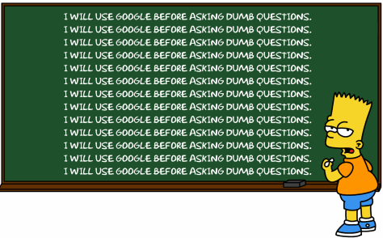
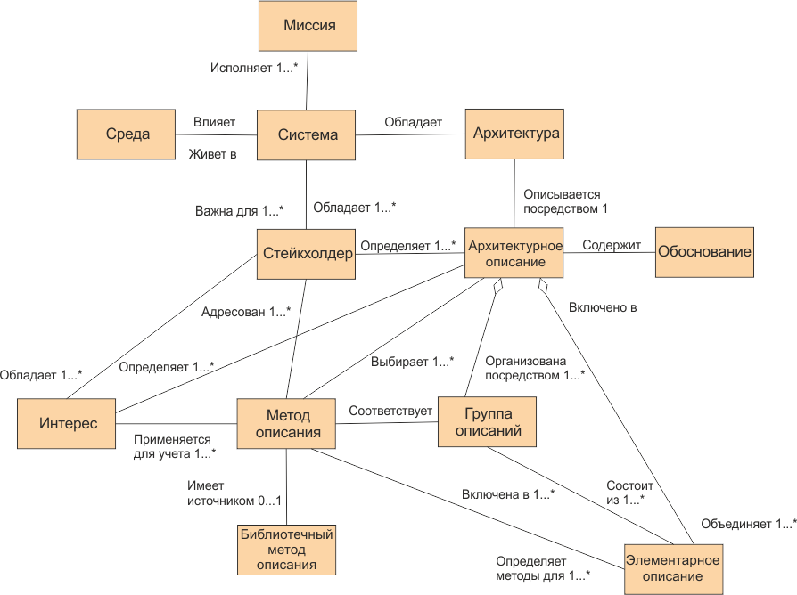
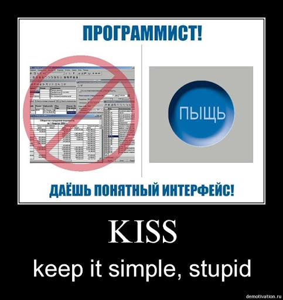

# Правила для студентів

## 1. Ставте питання викладачу.

## 2. Все можна знайти у Google.

## 3. Архітектура, потім код.

## 4. Make it work, make it right, make it fast.

## 5. Використовуй принцип KISS.

## 6. Теорія без практики мертва, практика без теорії сліпа.(с)

